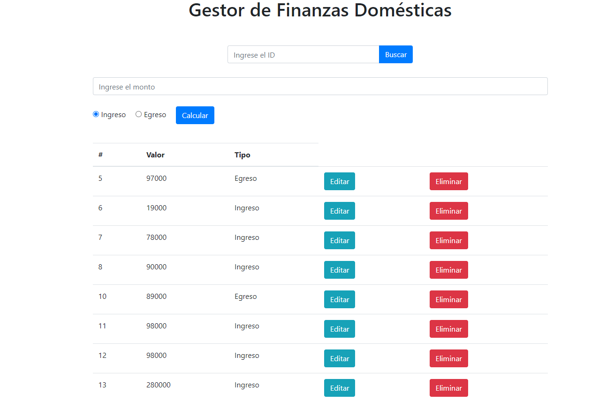

# Registro de Ingresos y Egresos

Este proyecto consiste en una aplicación web para el registro de ingresos y egresos, permitiendo llevar un control de las finanzas domésticas de manera sencilla y efectiva.

## Contenido

- [Descripción](#descripción)
- [Características](#características)
- [Instrucciones de Uso](#instrucciones-de-uso)
- [Tecnologías Utilizadas](#tecnologías-utilizadas)

---
## Descripción

El proyecto es una aplicación web que permite llevar un registro detallado de los ingresos y egresos. La interfaz es intuitiva y fácil de usar, lo que facilita el control de las finanzas personales.

## Características

- Registro de ingresos y egresos.
- Visualización de la lista de transacciones.
- Edición y eliminación de transacciones.
- Búsqueda de transacciones por ID.
- Cálculo automático de totales de ingresos, egresos y saldo restante.

## Instrucciones de Uso

1. Abre el archivo `index.html` en tu navegador web.
2. Ingresa el monto y selecciona el tipo (Ingreso o Egreso).
3. Haz clic en "Calcular" para registrar la transacción.
4. La tabla mostrará las transacciones registradas.
5. Puedes utilizar el campo de búsqueda por ID para encontrar transacciones específicas.
6. Para editar o eliminar una transacción, utiliza los botones correspondientes en la tabla.

## Tecnologías Utilizadas

- HTML
- CSS (Bootstrap)
- JavaScript

## Creado por 
[Santiago24x](https://github.com/Santiago24x)

--- 

*Nota: Asegúrate de tener una conexión a Internet activa para cargar los recursos externos (Bootstrap y estilos personalizados).*

*Se recomienda crear su propio [mockapi](https://mockapi.io/) para tener control propio de su informacion*