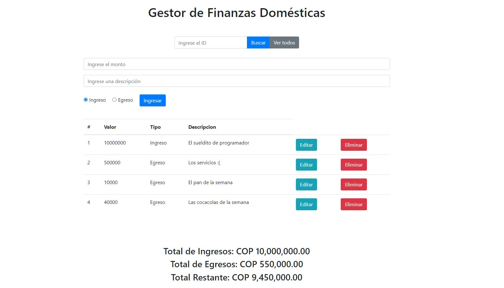

# Registro de Ingresos y Egresos



Este proyecto es una aplicación web diseñada para ayudarte a llevar un registro detallado de tus ingresos y egresos. Con esta herramienta, podrás gestionar tus finanzas domésticas de manera eficaz y mantener un control preciso sobre tus transacciones.

## Tecnologías Utilizadas

Este proyecto utiliza las siguientes tecnologías:

- **HTML5**: Para la estructura de la página.
- **CSS3**: Para el diseño y estilo.
- **JavaScript**: Para la funcionalidad dinámica.

## Requisitos Previos

Antes de comenzar, asegúrate de tener instalado [Node.js](https://nodejs.org) en tu máquina.

## Instalación

1. **Clona el Repositorio**:

    ```bash
    git clone https://github.com/santiago24x/registro-ingresos-egresos.git
    ```

2. **Instala las Dependencias**:

    ```bash
    npm install
    npm i json-server
    ```

## Iniciar el Servidor

Para simular una API, inicia el servidor de JSON Server con el siguiente comando:

```bash
npm run dev
```

## Cómo Usar la Aplicación

1. **Registra tus Transacciones**:

   - Ingresa el monto.
   - Describe la transacción.
   - Selecciona el tipo (Ingreso o Egreso).
   - Haz clic en "Ingresar".

2. **Buscar una Transacción**:

   - Ingresa el ID de la transacción en el campo de búsqueda y haz clic en "Buscar".

3. **Editar o Eliminar una Transacción**:

   - Utiliza los botones de "Editar" o "Eliminar" en la tabla de transacciones.

4. **Ver Totales**:

   - Los totales de ingresos, egresos y el saldo restante se actualizan automáticamente.

## Funcionalidades Destacadas

- **Registro Detallado**: Captura información específica sobre cada transacción.
- **Búsqueda por ID**: Encuentra transacciones rápidamente con el número de identificación.
- **Edición y Eliminación**: Permite ajustar o eliminar transacciones según sea necesario.
- **Cálculos Automatizados**: Proporciona totales actualizados en tiempo real.

## Explicaciones de Código


---

```javascript
document.addEventListener("DOMContentLoaded", () => {
  // ...
});
```

Este bloque de código asegura que el script JavaScript se ejecutará después de que la estructura del DOM haya sido completamente cargada. Esto es importante para garantizar que las interacciones con elementos HTML funcionen correctamente.

```javascript
async function mostrarDatos() {
  // ...
}
```

La función `mostrarDatos` es una función asincrónica que se encarga de obtener y mostrar los datos de la API. Utiliza una solicitud `fetch` para obtener la respuesta de la API y luego la convierte a formato JSON. Los datos se muestran en una tabla HTML y también se calculan los totales de ingresos y egresos.

```javascript
async function manejarEnvio(e) {
  // ...
}
```

La función `manejarEnvio` se encarga de manejar el envío del formulario. Captura los datos del formulario (monto, descripción y tipo de transacción) y los envía a la API a través de una solicitud `fetch`. También maneja la edición de registros si el botón de "Actualizar" se presiona.

```javascript
function manejarClickTabla(e) {
  // ...
}
```

La función `manejarClickTabla` se encarga de manejar los clics en la tabla de registros. Si se hace clic en el botón "Editar", se obtiene el ID del registro y se carga en el formulario para su edición. Si se hace clic en el botón "Eliminar", se elimina el registro.

```javascript
function buscarPorId() {
  // ...
}
```

La función `buscarPorId` permite buscar un registro por su ID. Utiliza una solicitud `fetch` para obtener el registro correspondiente y lo muestra en la tabla.

```javascript
const btnRecargar = document.getElementById("btnRecargar");
btnRecargar.addEventListener("click", () => {
    location.reload();
});
```

El botón "Ver todos" recarga la página, lo que efectivamente restablece la vista a todos los registros en la tabla.

---

Estas explicaciones proporcionan una visión general de las funciones y bloques de código clave en el proyecto. Si hay alguna otra parte específica del código que desees que explique en detalle, no dudes en decírmelo. Estoy aquí para echarte una manito.

## Contribuciones

¡Las contribuciones son bienvenidas! Si encuentras algún problema o tienes ideas para mejoras, no dudes en abrir un *Pull Request*.

## Contacto

Para cualquier consulta o sugerencia, no dudes en contactar a [Santiago Márquez ➲](santiagomarquez.it@gmail.com).

---